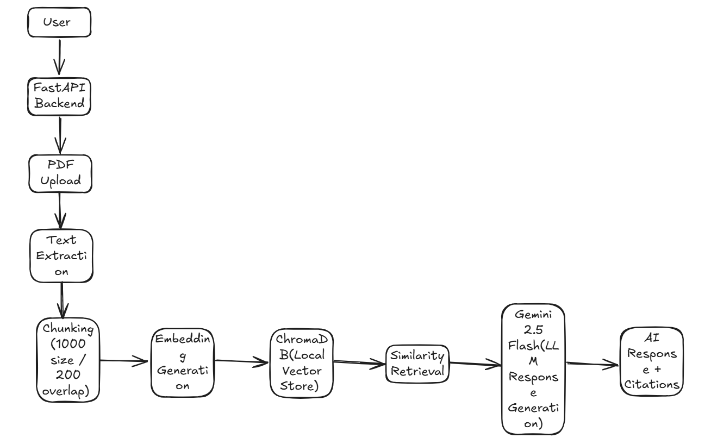

# Technical Recommendation Report: AI Research Assistant MVP

## 1. Executive Summary
The AI Research Assistant MVP is a lightweight, high-performance Retrieval-Augmented Generation (RAG) backend designed to automate document intelligence workflows. This system enables users to upload PDF documents, index their content semantically using vector embeddings, query the document database via natural language, and generate grounded answers with citations. Additionally, it provides an aggregate document summarization feature. Built using Python, FastAPI, LangChain, ChromaDB, and the Google Gemini 2.5 Flash API, this MVP serves as a foundational prototype demonstrating cost-effective, production-ready RAG architecture.

---

## Key Technical Highlights
* **Retrieval-Augmented Generation (RAG)** workflow for grounded information access.
* **Semantic similarity search** using Google's `gemini-embedding-001` model.
* **Citation-grounded AI responses** yielding page-level sources and excerpts.
* **Persistent ChromaDB vector storage** configured locally for persistent indexing.
* **Gemini-powered document summarization** summarizing long document content.
* **Modular FastAPI backend architecture** with strict router-service separation.

---

## 2. Problem Statement
Researchers and business analysts face document information overload. Sifting through high-volume, multi-page PDFs to locate specific details is time-consuming and labor-intensive. 

Traditional search methods rely on exact keyword matches, failing to capture semantic meaning or synonyms. While standard Large Language Models (LLMs) can synthesize answers, they suffer from two primary issues when dealing with custom documents:
1. **Context Window Limitations**: Processing whole libraries of long documents directly in a single LLM prompt is computationally expensive and slow.
2. **Hallucinations**: Out-of-the-box LLMs generate answers based on training data and may confidently invent facts when asked about custom, private, or novel business datasets.

---

## 3. Proposed Solution
This project implements a local-first **Retrieval-Augmented Generation (RAG)** pipeline. RAG solves the document overload, context window, and hallucination issues by:
* Dividing uploaded PDF documents into smaller, overlapping semantic chunks.
* Storing numerical vector representations (embeddings) of these chunks in a local vector database (ChromaDB).
* Dynamically retrieving the top $k$ matching chunks for any user question using vector similarity.
* Supplying only the relevant chunks to the LLM (Gemini 2.5 Flash) as a source context, forcing it to generate grounded answers with page-level citations.

---

## 4. Architecture Overview

The system is designed using a clean, service-oriented architecture that separates API request management from business logic:

```
                  +--------------------------+
                  |  FastAPI Router Layer    |
                  |  (health, upload, query, |
                  |   summary routes)        |
                  +-------------+------------+
                                |
         +----------------------+----------------------+
         |                      |                      |
         v                      v                      v
+------------------+  +------------------+  +------------------+
|   PDF Service    |  |Embedding Service |  |Retrieval Service |
| (PyPDFLoader &   |  | (Gemini Embed-   |  | (Vector Query &  |
|  Text Splitter)  |  |  dings & Chroma) |  |  Gemini RAG)     |
+--------+---------+  +--------+---------+  +--------+---------+
         |                     |                     |
         +---------------------+---------------------+
                               |
                               v
                    +--------------------+
                    |  Database Layer    |
                    | (ChromaDB Vector   |
                    |  Store on Disk)    |
                    +--------------------+
```

### Architecture Diagram


### Components
1. **API Router Layer (`routes/`)**: Declares FastAPI endpoints, handles input schema validation (via Pydantic), and manages HTTP error statuses.
2. **Service Layer (`services/`)**: Implements standalone business logic. This includes PDF text extraction, document chunking, embedding generation, database writes, context retrieval, and LLM text generation.
3. **Database Layer (`database/`)**: Handles the initialization of the persistent ChromaDB client and configures the Google Generative AI embeddings helper.

---

## 5. Technology Stack Selection

The stack was chosen to prioritize minimal operational overhead, developer productivity, and scalability:

* **FastAPI**: A modern, high-performance web framework. Selected for its asynchronous capabilities, auto-generated OpenAPI/Swagger documentation, and native Pydantic validation.
* **LangChain**: Utilized as a lightweight abstraction layer for vector database operations, prompt formatting, and LLM integration.
* **ChromaDB**: An open-source, developer-friendly vector database. Its support for persistent local SQLite-based storage makes it ideal for lightweight MVPs, avoiding the cost and complexity of a remote cloud database cluster.
* **Gemini 2.5 Flash**: Google's efficient, multimodal model. Selected for its speed, low API cost, and high quality of reasoning for RAG tasks.
* **Google Embeddings (`gemini-embedding-001`)**: Used to convert text chunks into dense vectors. Provides high semantic mapping accuracy and native compatibility with the Gemini ecosystem.
* **Python**: The industry standard for AI/ML engineering, offering rich library ecosystems and ease of maintenance.

---

## 6. AI Tool Comparison Summary

Selecting the appropriate LLM and embedding model is critical for balancing response quality, latency, and cost.

| Model / API | Provider | Cost (per 1M input tokens) | Context Window | Best Use Case |
|---|---|---|---|---|
| **Gemini 2.5 Flash** | Google | **$0.075** (under 128k) | **1,000,000 tokens** | **MVP Ingestion & Querying (Speed & Cost)** |
| **GPT-4o-mini** | OpenAI | $0.150 | 128,000 tokens | General-purpose low-cost applications |
| **Claude 3.5 Haiku** | Anthropic | $0.800 | 200,000 tokens | Fast reasoning and coding assistance |
| **Gemini 1.5 Pro** | Google | $1.250 (under 128k) | 2,000,000 tokens | Deep reasoning over massive codebases/media |

### Rationale for Gemini 2.5 Flash
Gemini 2.5 Flash is selected as the primary query engine because:
1. **Low Latency**: It is optimized for high-speed, lightweight tasks, minimizing end-user wait times.
2. **Cost-Efficiency**: At $0.075 per million input tokens, it is significantly cheaper than competing models like GPT-4o-mini and Claude 3.5 Haiku.
3. **Generous Context Window**: Offers a 1 million token context, enabling summarization operations over large combined text chunks without context exhaustion.

---

## 7. Workflow Explanation

### A. Document Ingestion Pipeline
1. **Upload**: The user uploads a `.pdf` file via `POST /upload-pdf`.
2. **Extraction & Chunking**: `pdf_service.py` uses `PyPDFLoader` to extract page text and metadata (e.g. source file, page number). It splits the text using a `RecursiveCharacterTextSplitter` configured with a `chunk_size` of 1000 characters and a `chunk_overlap` of 200 characters to maintain semantic context across boundaries.
3. **Embedding**: `embedding_service.py` sends the text chunks to the Google Embeddings API, which outputs 768-dimensional floating-point vectors.
4. **Storage**: The vectors and document chunks are written to the local ChromaDB database and persisted to disk in `data/chroma_db/`.

### B. Retrieval and Generation Pipeline
1. **Query**: The user sends a question via `POST /ask`.
2. **Verification**: The route verifies that the database contains indexed documents.
3. **Similarity Search**: ChromaDB performs an approximate nearest neighbor (ANN) search comparing the query's vector representation with the stored document vectors, returning the top 4 most relevant chunks.
4. **Response Generation**: The service builds a structured prompt containing the user question and the retrieved document chunks. The prompt forces Gemini 2.5 Flash to act as a grounded assistant.
5. **Formatting**: Citations are extracted by mapping retrieved chunks back to their 1-indexed document pages alongside a concise (maximum 150 characters) excerpt. The API returns the answer and the citations.

### C. Summarization Pipeline
1. **Aggregate Query**: The user requests a summary via `GET /summarize`.
2. **Context Compilation**: The service retrieves all raw document chunks from ChromaDB and joins them together.
3. **Summary Generation**: Gemini 2.5 Flash processes the combined text and generates a structured, business-friendly summary with bullet points highlighting key findings and takeaways.

---

## 8. Cost Considerations

Operational costs for the AI Research Assistant MVP are split into two categories:

### A. API Call Costs (Variable)
* **Embedding Cost (`gemini-embedding-001`)**: Charging $0.025 per 1M tokens. Indexing a 100-page textbook (~40,000 words or ~50,000 tokens) costs approximately **$0.00125**.
* **Generation Cost (`gemini-2.5-flash`)**: Charging $0.075 per 1M input tokens and $0.30 per 1M output tokens. A RAG query with 4,000 input tokens of context and a 200-token answer costs approximately **$0.00036**.

### B. Infrastructure Costs (Fixed)
* **Hosting**: The backend can run on basic CPU-only server instances (e.g., AWS EC2 t3.medium or Render Starter) because vector computations and LLM inference are offloaded to Google's cloud. Estimated hosting cost: **$7.00 - $15.00/month**.
* **Storage**: Persistent SQLite ChromaDB files and uploaded PDFs require minimal local SSD storage, costing pennies.

---

## 9. Risks & Limitations

### A. Security & Privacy
* **API Leakage**: Code relies on loading `GOOGLE_API_KEY` from the environment. Leaked keys can result in unexpected usage charges.
* **Data Privacy**: Document contexts are sent to Google's APIs. For strictly confidential corporate data, this requires upgrading to enterprise terms of service or self-hosting local embeddings/LLMs (e.g., using Ollama).

### B. Technical Constraints
* **SQLite ChromaDB Limitations**: The local ChromaDB storage uses SQLite under the hood. While perfect for single-user MVPs or small collections, it does not support high-concurrency write operations or horizontal scaling.
* **Hallucination Risk**: If a document does not contain the answer, the LLM may still attempt to infer or hallucinate if the system prompt constraints are bypassed.
* **Context Overload**: Combining all chunks for the `/summarize` endpoint works for medium documents. However, for extremely large document libraries (e.g., thousands of pages), combining all text will exceed context windows or lead to lower-quality summaries ("Lost in the Middle" phenomenon).

---

## 10. Scalability Considerations

To transition this MVP into an enterprise-grade production system handling high-concurrency workloads, the following scaling improvements are recommended:

* **Distributed Vector Database**: Migrate from local SQLite-based ChromaDB to a managed distributed vector database like **Pinecone** or **Weaviate**. This enables horizontal scaling, high concurrency, and faster index querying.
* **Asynchronous Ingestion**: Offload heavy PDF processing and embedding workloads from the FastAPI thread pool to a **background task processing** worker (using **Celery** or **ARQ** backed by **Redis** or **RabbitMQ**).
* **Cloud Object Storage**: Move local file storage (`data/uploads/`) to cloud-native object storage (e.g. **AWS S3** or **Google Cloud Storage**) for durable, distributed file management.
* **High-Performance Caching**: Integrate a **Redis caching layer** to cache common user queries and RAG outputs, reducing redundant calls to the Gemini API and database.
* **Multi-User Document Isolation**: Implement tenant-based multi-user document management, isolating indexes in the vector database using namespaces or partition filters to enforce strict access control.
* **Authentication and Security**: Add secure authentication systems (such as OAuth2, JWT, or Auth0) to protect endpoints, manage user roles, and secure file actions.
* **Containerized Deployment**: Containerize the FastAPI application using **Docker** and orchestrate deployments via **Kubernetes** or **AWS ECS** to scale stateless backend replicas dynamically.

---

## 11. Future Improvements

To improve retrieval precision and user experience:
* **Hybrid Search**: Combine vector similarity search with BM25 keyword matching to handle technical jargon, abbreviations, and exact part numbers.
* **Metadata Filtering**: Index chunks with document-specific metadata (upload date, category, filename) to allow users to target specific subsets of files.
* **Semantic Caching**: Integrate a cache (such as GPTCache) to store and reuse previous vector queries and responses, reducing API latency and LLM costs.
* **Evaluation Pipeline**: Implement RAG evaluation frameworks (such as Ragas or TruLens) to measure faithfulness, answer relevance, and context recall over time.

---

## 12. Conclusion
The AI Research Assistant MVP successfully demonstrates a modular, RAG-based document search and summarization backend. By utilizing FastAPI, ChromaDB, and Gemini 2.5 Flash, the prototype offers high-speed execution, accurate grounded responses with page-level citations, and exceptionally low operating costs. Moving forward, the modular service boundaries established in this code will allow seamless upgrades to enterprise-grade vector databases and background processing queues when scaling up.

---

## Repository

GitHub Repository:
https://github.com/AmanDevNet/AI-Research-Assistant
